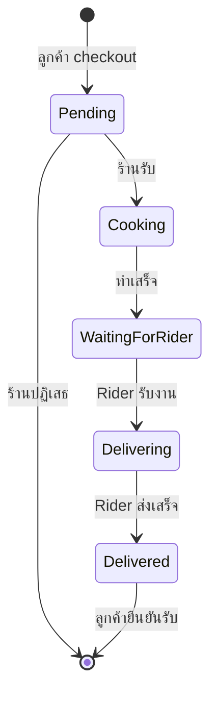

# Project_CP353 — ระบบสั่งอาหาร Delivery

แอปพลิเคชันสั่งอาหารแบบ Desktop สำหรับวิชา **CP353** ลูกค้าเลือกร้านและสั่งอาหาร ร้านจัดการเมนูและออเดอร์เข้า Rider รับงานและส่งอาหาร ระบบใช้สถาปัตยกรรม **3-Tier**: WinForms Client, ASP.NET Core REST API และ PostgreSQL

## เกี่ยวกับโปรเจกต์

โปรเจกต์นี้แสดงวงจรออเดอร์ครบวงจร — ตั้งแต่ตะกร้าและ checkout การทำอาหารที่ร้าน การรับงานของ Rider จนถึงลูกค้ายืนยันรับของ — โดยแยก UI ตามบทบาทผู้ใช้

การเข้าสู่ระบบใช้ **User ID** (ตัวเลข) แทน username/password API คืน Role (`Customer`, `Restaurant`, `Rider`) แล้ว Client เปิดฟอร์มที่ตรงกับ Role นั้น

## ฟีเจอร์หลัก

| บทบาท | ความสามารถ |
|--------|------------|
| **ลูกค้า (Customer)** | เลือกร้าน, เพิ่ม/ลดสินค้าในตะกร้า, checkout, ติดตามสถานะออเดอร์ (poll ทุก 3 วินาที), ยืนยันรับอาหาร |
| **ร้าน (Restaurant)** | แก้ชื่อร้านและเมนู (เพิ่ม/แก้/ลบ), รับ/ปฏิเสธออเดอร์, แจ้งทำอาหารเสร็จ |
| **Rider** | ดูออเดอร์รอส่ง, รับงาน, ยืนยันส่งสำเร็จ |

- REST API กับ Entity Framework Core และ PostgreSQL  
- นำทาง WinForms ตาม Role หลัง login  
- ตะกร้าแยกตามลูกค้าและร้าน (ไม่ปนกันระหว่างร้าน)  
- อัปเดตสถานะออเดอร์บนหน้าลูกค้าแบบ real-time  

## เทคโนโลยีที่ใช้

| ชั้น | เทคโนโลยี |
|------|-----------|
| Client | .NET 8, Windows Forms |
| API | ASP.NET Core 8, REST Controllers |
| Data | Entity Framework Core, Npgsql (PostgreSQL) |
| ฐานข้อมูล | PostgreSQL 14+ (แนะนำ) |

## สถาปัตยกรรม

```
┌─────────────────────┐     HTTP (JSON)      ┌─────────────────────┐
│  Delivery.Client    │ ◄──────────────────► │  Delivery.Api       │
│  (WinForms)         │   localhost:5000     │  (ASP.NET Core)     │
└─────────────────────┘                      └──────────┬──────────┘
                                                        │
                                                        ▼
                                             ┌─────────────────────┐
                                             │  PostgreSQL         │
                                             │  (DeliveryDB)       │
                                             └─────────────────────┘
                                                        ▲
                                             ┌──────────┴──────────┐
                                             │  Delivery.Data      │
                                             │  (EF Core entities) │
                                             └─────────────────────┘
```

Client เรียก API ที่ `http://localhost:5000/api/` ผ่านคลาส `RestUtil`

## สิ่งที่ต้องมีก่อนรัน

- [.NET 8 SDK](https://dotnet.microsoft.com/download/dotnet/8.0)
- [PostgreSQL](https://www.postgresql.org/) (รันบนเครื่องตัวเอง)
- Windows (จำเป็นสำหรับ WinForms Client)

## วิธีติดตั้งและรัน

### 1. ตั้งค่าฐานข้อมูล

สร้างฐานข้อมูลชื่อ `DeliveryDB` แล้วรันสคริปต์:

```bash
psql -U postgres -d DeliveryDB -f Delivery/Delivery.Data/myDB.sql
```

ใส่ข้อมูลตัวอย่างอย่างน้อย 1 User ต่อ Role ในตาราง `users` และข้อมูลที่เกี่ยวข้อง (`restaurants`, `riders`, `menu_items`)

### 2. ตั้งค่า API (ถ้าจำเป็น)

Connection string เริ่มต้นใน `Delivery/Delivery.Api/Program.cs`:

```
Host=localhost;Port=5432;Username=postgres;Password=password;Database=DeliveryDB
```

แก้ username/password ให้ตรงกับ PostgreSQL ของคุณ

### 3. รัน API

```bash
dotnet run --project Delivery/Delivery.Api
```

- URL: `http://localhost:5000`  
- ทดสอบว่ารันอยู่: `GET http://localhost:5000/`

### 4. รัน Client

เปิดเทอร์มินัลอีกหน้าต่าง:

```bash
dotnet run --project Delivery/Delivery.Client
```

**รัน API ก่อน Client เสมอ** แล้ว login ด้วย User ID ที่มีในฐานข้อมูล

### Build ทั้ง solution

```bash
dotnet build Delivery/Delivery.sln
```

## โครงสร้างโปรเจกต์

```
Project_CP353/
├── Delivery/
│   ├── Delivery.sln              # Solution ของ Visual Studio
│   ├── Delivery.Client/          # UI WinForms (Login, Customer, Restaurant, Rider)
│   │   ├── Models/               # DTO สำหรับรับ-ส่งกับ API
│   │   └── RestUtil.cs           # ตัวช่วยเรียก HTTP
│   ├── Delivery.Api/             # REST API
│   │   └── Controllers/          # Auth, Restaurants, Carts, Orders, Riders
│   └── Delivery.Data/            # DbContext และ Entity
│       └── myDB.sql              # สคริปต์สร้างตาราง PostgreSQL
├── README.md
└── LICENSE
```

| โปรเจกต์ | บทบาท |
|----------|--------|
| `Delivery.Client` | หน้าจอตาม Role (ลูกค้า / ร้าน / Rider) |
| `Delivery.Api` | REST API ที่พอร์ต 5000 |
| `Delivery.Data` | Entity Framework + สคริปต์ `myDB.sql` |

## สรุป API (Controllers)

| Controller | หน้าที่ |
|------------|--------|
| `AuthController` | Login ด้วย User ID |
| `RestaurantsController` | ร้าน, เมนู, แก้ไขข้อมูลร้าน |
| `CartsController` | ดู/เพิ่ม/ลดสินค้าในตะกร้า |
| `OrdersController` | รายการออเดอร์, checkout, เปลี่ยนสถานะ, ลบ |
| `RidersController` | งานที่กำลังส่ง, ยืนยันส่งเสร็จ |

## วงจรสถานะออเดอร์

```
Pending → Cooking → Waiting for rider → Delivering → Delivered → (ลูกค้ายืนยันรับ → ลบออเดอร์)
```

- ร้าน **ลบ**ออเดอร์ได้เมื่อยัง `Pending` (ปฏิเสธ)  
- ลูกค้า **ลบ**ออเดอร์หลังยืนยันรับอาหาร  



## โมเดลข้อมูล (ย่อ)

- **User** — ผู้ใช้ทุกคน (Role: Customer / Restaurant / Rider)
- **Restaurant** — ผูกกับ User หนึ่งคน (1 ร้านต่อ 1 user)
- **Rider** — ผูกกับ User หนึ่งคน
- **MenuItem** — เมนูของแต่ละร้าน
- **Cart / CartItem** — ตะกร้าชั่วคราวก่อน checkout
- **Order / OrderItem** — ออเดอร์จริงหลัง checkout (เก็บราคา ณ ขณะสั่ง)

## สรุป Endpoint หลัก

| กลุ่ม | Endpoint สำคัญ |
|-------|----------------|
| Auth | `POST /api/auth/login` |
| ร้าน | `GET /api/restaurants`, `GET .../by-user/{userId}`, `GET .../menu` |
| ตะกร้า | `GET/POST/DELETE /api/carts/{userId}/{restaurantId}/...` |
| ออเดอร์ | `GET /api/orders`, `POST /api/orders/checkout`, `PATCH .../status`, `DELETE .../{id}` |
| Rider | `GET /api/riders/{userId}/current-order`, `POST .../complete/{orderId}` |

---

## Workflow การทำงาน

### ภาพรวม

```
[Login] ──Role──► CustomerForm | RestaurantForm | RiderForm
                      │                │              │
                      ▼                ▼              ▼
                 สั่งอาหาร          จัดการเมนู/ออเดอร์   รับ-ส่งออเดอร์
                      │                │              │
                      └────────────────┴──────────────┘
                                       │
                              Delivery.Api + PostgreSQL
```

### 1. การเข้าสู่ระบบ (Login)

1. เปิดแอป → หน้า **Login**
2. กรอก **User ID** (ตัวเลขเท่านั้น)
3. `POST /api/auth/login` → ค้นหาในตาราง `users`
4. ได้ `Role` แล้วเปิดฟอร์มตามบทบาท:

| Role | ฟอร์มที่เปิด |
|------|-------------|
| `Customer` | `CustomerForm` |
| `Restaurant` | `RestaurantForm` |
| `Rider` | `RiderForm` |

5. หน้า Login **ซ่อน**ไว้ (ไม่ปิด) เพื่อไม่ให้แอปหยุดทันที
6. ปิดฟอร์มหลักแล้วไม่มี Login ค้าง → `Application.Exit()`

### 2. ฝั่งลูกค้า (Customer)

#### เลือกร้าน (`CustomerForm`)

1. `GET /api/restaurants` → แสดงการ์ดร้าน
2. คลิกการ์ด → เปิด `MenuForm`
3. **ติดตามออเดอร์** — เลือกออเดอร์ที่ยังไม่จบ (หรืออันล่าสุด) → `OrderStatusForm`
4. **ออกจากระบบ** → กลับ Login

#### สั่งอาหาร (`MenuForm`)

| การกระทำ | API |
|----------|-----|
| โหลดเมนู | `GET /api/restaurants/{restaurantId}/menu` |
| เพิ่ม (+) | `POST /api/carts/{userId}/{restaurantId}/items` |
| ลด (-) | `DELETE /api/carts/.../items/{itemId}` |
| ดูยอดรวม | `GET /api/carts/{userId}/{restaurantId}` |

**Checkout:** ตรวจตะกร้าไม่ว่าง → `POST /api/orders/checkout` (สถานะ `Pending`, ลบตะกร้า) → เปิด `OrderStatusForm`

#### ติดตามออเดอร์ (`OrderStatusForm`)

- Poll ทุก 3 วินาที: `GET /api/orders/{orderId}/details`

| สถานะใน DB | ความหมายบนหน้าจอ |
|------------|------------------|
| `Pending` | ร้านรับออเดอร์แล้ว |
| `Cooking` | ร้านกำลังทำอาหาร |
| `Waiting for rider` | กำลังหา Rider |
| `Delivering` | Rider กำลังไปส่ง |
| `Delivered` / `Completed` / `Success` | จัดส่งสำเร็จ |

- ถึงขั้นสุดท้าย → ปุ่ม **ได้รับอาหารแล้ว** → `DELETE /api/orders/{orderId}`
- API ตอบ 404 → แสดงสถานะเสร็จสิ้น

### 3. ฝั่งร้าน (Restaurant)

#### หน้าหลัก (`RestaurantForm`)

- โหลดชื่อร้าน: `GET /api/restaurants/by-user/{userId}`
- **แก้ไขร้าน/เมนู** → `RestaurantEditForm`
- **จัดการออเดอร์** → `RestaurantOrdersForm`

#### แก้ไขเมนู (`RestaurantEditForm`)

| การกระทำ | API |
|----------|-----|
| บันทึกชื่อร้าน | `PUT /api/restaurants/{restaurantId}` |
| เพิ่มเมนู | `POST /api/restaurants/{restaurantId}/menu` |
| แก้เมนู | `PUT /api/restaurants/menu/{itemId}` |
| ลบเมนู | `DELETE /api/restaurants/menu/{itemId}?restaurantId=...` |

#### จัดการออเดอร์ (`RestaurantOrdersForm`)

แสดงเฉพาะ `Pending` และ `Cooking`

| ปุ่ม | เงื่อนไข | ผลลัพธ์ |
|------|----------|---------|
| รับออเดอร์ | `Pending` | → `Cooking` |
| ปฏิเสธ | `Pending` | ลบออเดอร์ |
| ทำเสร็จ | `Cooking` | → `Waiting for rider` |

### 4. ฝั่ง Rider

#### รายการรอรับ (`RiderForm`)

1. `GET /api/orders?status=Waiting%20for%20rider`
2. Refresh ทุก 30 วินาที
3. **รับงาน** → `PATCH .../accept-rider/{userId}` → สถานะ `Delivering`
4. **งานของฉัน** → `RiderOrderForm`

#### ส่งออเดอร์ (`RiderOrderForm`)

1. `GET /api/riders/{userId}/current-order`
2. **ส่งสำเร็จ** → `POST .../complete/{orderId}` → ออเดอร์ `Delivered`, Rider `Available`

### วงจรสถานะ (สรุป)

```
ลูกค้า checkout          →  Pending
ร้านกดรับ                →  Cooking
ร้านทำเสร็จ              →  Waiting for rider
Rider รับงาน             →  Delivering
Rider ส่งเสร็จ           →  Delivered
ลูกค้ายืนยันรับอาหาร      →  ลบออเดอร์

ร้านปฏิเสธ (Pending)     →  ลบออเดอร์
```

---

## หมายเหตุ

- Connection string อยู่ใน `Delivery.Api/Program.cs` (PostgreSQL localhost:5432)
- ต้องรัน API ก่อน Client
- หลัง checkout ตะกร้าจะถูกลบ — เป็นพฤติกรรมที่ออกแบบไว้

## ใบอนุญาต

โปรเจกต์นี้ใช้ [MIT License](LICENSE)
